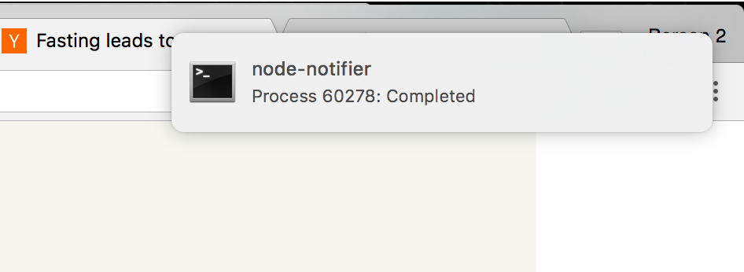

# PWatch [](https://badge.fury.io/js/pwatch)

Get native notifications when your long running processes finish!



## Usage

Add `pwatch` at the end of your command.

```
sleep 10 | pwatch
```
or

```
sleep 10 && pwatch
```
or 

```
sleep 10; pwatch
```

Or if you forget to call it when running your command

```
$ scp somelargefile.tar.gz root@remotehost:~
$ ps aux | grep scp
justink          60132   0.0  0.2  3041904  31712 s018  S+   12:15PM   0:00.20 scp somelargefile.tar.gz root@remotehost:~
$ pwatch 60132
```

You can even use it to be notified upon SSH tunnel closing.
```
$ ssh root@remotehost
# in another shell...
$ ps aux | grep ssh
justink          60132   0.0  0.2  3041904  31712 s018  S+   12:15PM   0:00.20 ssh root@remotehost
$ pwatch 60132
```

Then get notified when that process finishes.
